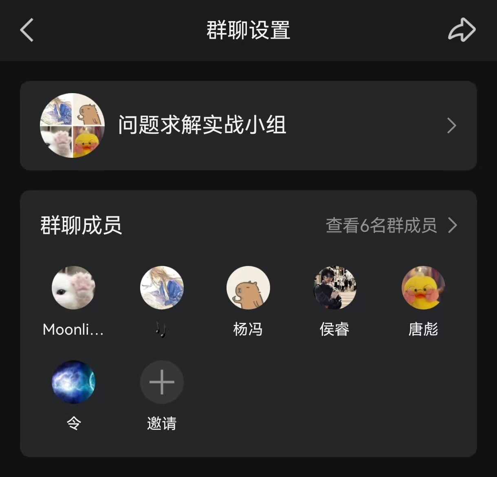
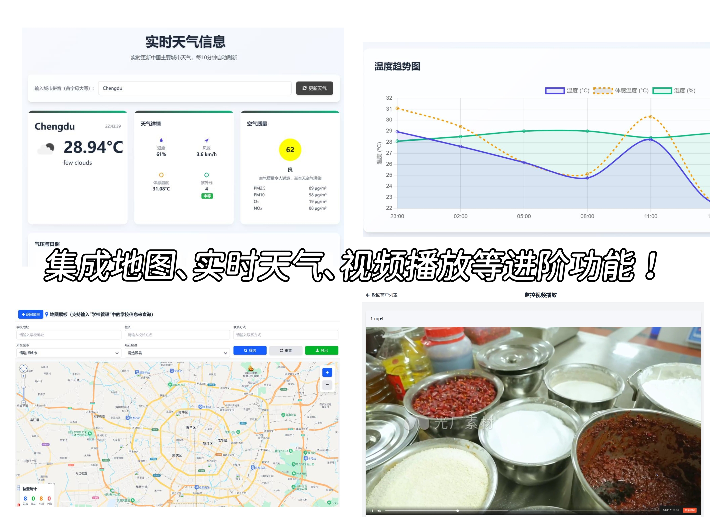
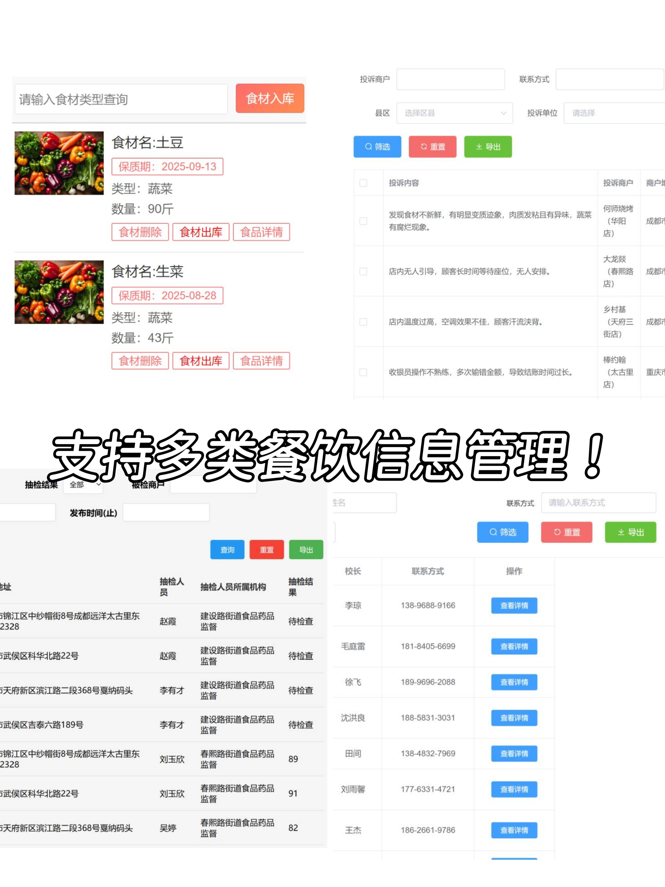

# 🌻 KitchenWatchtower(明厨亮灶管理系统)
<div align="center">

</div>
<b>
  This is a team project for Sichuan University's Problem Solving Practical Course, implementing a kitchen monitoring system with real-time data visualization web-end and mini-program integration.
<b>

<div align="center">
   
  
</div>

## 📸 Project Highlights
<div align="center">
  <div style="display: flex; gap: 15px; justify-content: center; flex-wrap: wrap;">
    <div style="display: flex; flex-direction: column; align-items: center;">
      
      <p style="margin-top: 8px; color: #666; font-size: 0.9em;">丰富进阶功能支持</p>
    </div>
    <div style="display: flex; flex-direction: column; align-items: center;">
      
      <p style="margin-top: 8px; color: #666; font-size: 0.9em;">系统多数据仪表盘</p>
    </div>
    <div style="display: flex; flex-direction: column; align-items: center;">
      
      <p style="margin-top: 8px; color: #666; font-size: 0.9em;">必备交互功能齐全</p>
    </div>
    <div style="display: flex; flex-direction: column; align-items: center;">
      
      <p style="margin-top: 8px; color: #666; font-size: 0.9em;">AI智能识别功能集成</p>
    </div>
  </div>
</div>

## 🚀 Quick Start

### Run Web Application
1. Import project to IDEA:
   ```bash
   Drag the "KitchenWeb" directory into IntelliJ IDEA
   ```
2. Start application:
   - Click the "Run" button in IDEA
   - Access web interface via:
     ```
     http://localhost:8080/menu.html
     ```

### Database Preparation
1. Open terminal and navigate to project directory
   ```bash
   cd KITCHENWATCHTOWER
   ```

2. Log in to MySQL database
   ```bash
   mysql -u <your_username> -p
   ```
   Enter your MySQL password when prompted

3. Create new database with UTF8MB4 support
   ```sql
   CREATE DATABASE KitchenWatchtower 
   CHARACTER SET utf8mb4 
   COLLATE utf8mb4_unicode_ci;
   ```

4. Switch to the new database
   ```sql
   USE KitchenWatchtower;
   ```

5. Import SQL schema
   ```bash
   source ./KitchenWatchtower.sql
   ```

   _Database preparation completed!_

### Run Mini-Program

1. Update configuration files in web application:
   - Modify database connection settings in `KitchenWeb\src\main\java\com\example\demo\dao`
   - Update all the `root` and `password` parts

2. Rerun web application and ensure web application is running 

3. Import project to WeChat Developer Tools:
   ```bash
   Drag the "KitchenMiniProgram" directory into WeChat Developer Tools
   ```

4. Update mini-program configuration:

   Modify `appid` in `KitchenMiniProgram/project.config.json`
     ```json
     {
       "appid": "<your-app-id>"
     }
     ```

5. Build and preview:
   
   Click "Compile" button in WeChat Developer Tools

   _start mini-program journey!_

## 📋 Recommended Requirements
- JAVA 
- MySQL 8.0+ 
- IntellJ IDEA 2019.3.3+
- 新版的微信开发者工具

## 📂 Project Structure
```
KITCHENWATCHTOWER/
├── KitchenWeb/          # Web application source code
├── KitchenMiniProgram/  # WeChat mini-program source code
├── page/               # Documentation assets
└── KitchenWatchtower.sql # Database schema
```

## 🌷 Acknowledgement

We would like to express our sincere gratitude to the following group members for their collaboration and contributions:

- 侯睿

- 杨冯

- 唐彪

- 黄泳

- 尹海东

- 吴嘉俊

We are also deeply thankful to our teacher, 辛卫, for the guidance and support throughout the project!